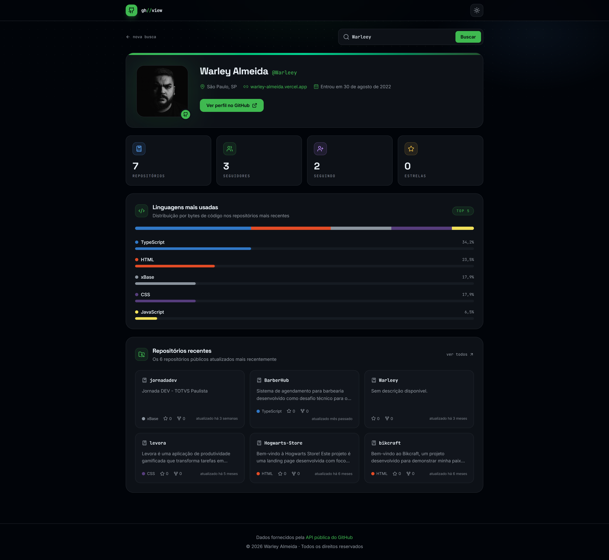

# githubview

> Visualize estatísticas, repositórios e linguagens de qualquer perfil do GitHub em tempo real.



**Demo:** em breve

---

## Funcionalidades

- Busca de qualquer usuário do GitHub com validação de username
- Card de perfil completo: avatar, bio, empresa, localização, blog e data de criação
- 4 cards de estatísticas com animação count-up: repositórios, seguidores, seguindo e estrelas
- 6 repositórios mais recentes com linguagem, estrelas, forks e tempo relativo
- Gráfico de linguagens com barra segmentada e barras de progresso animadas
- Tema dark/light com alternância persistida no localStorage
- Histórico das últimas 5 buscas com remoção individual
- Rotas dinâmicas por usuário — `/torvalds`, `/filipedeschamps`
- Skeleton loading espelhando o layout exato
- Estados tratados: loading, erro (404, rate limit, rede), vazio e sucesso
- Layout responsivo, mobile first

---

## Tecnologias

| Ferramenta | Papel |
| --- | --- |
| React 19 + TypeScript | Base da UI com tipagem estrita |
| Vite | Build tool e dev server |
| Tailwind CSS 4 | Design tokens via CSS vars com suporte a dark/light mode |
| Axios | Cliente HTTP com erros normalizados |
| TanStack Query | Cache por usuário (5 min) e retry inteligente |
| React Router DOM v7 | Rotas dinâmicas `/:username` |
| Lucide React | Ícones |

---

## Como rodar localmente

**Pré-requisitos:** [Node.js 18+](https://nodejs.org)

```bash
# Clone o repositório
git clone https://github.com/Warleey/githubview.git
cd githubview

# Instale as dependências
npm install

# Inicie o servidor de desenvolvimento
npm run dev
```

Acesse `http://localhost:5173`

### Token do GitHub (opcional)

A API pública permite 60 requisições/hora por IP. Para aumentar para 5.000/hora, crie um arquivo `.env` na raiz:

```env
VITE_GITHUB_TOKEN=seu_token_aqui
```

Gere seu token em [github.com/settings/tokens](https://github.com/settings/tokens) — nenhum escopo necessário.

### Scripts

```bash
npm run dev      # desenvolvimento
npm run build    # build de produção
npm run preview  # preview do build
```

---

## Deploy na Vercel

O projeto inclui `vercel.json` com rewrite de SPA para as rotas dinâmicas funcionarem:

```json
{ "rewrites": [{ "source": "/(.*)", "destination": "/index.html" }] }
```

1. Suba o projeto para um repositório no GitHub
2. Em [vercel.com](https://vercel.com), importe o repositório
3. Framework detectado automaticamente: **Vite**
4. Adicione a variável `VITE_GITHUB_TOKEN` nas configurações do projeto (opcional)
5. Deploy ✅

---

## Estrutura do projeto

```
src/
├── components/
│   ├── EmptyState/       # Tela inicial com sugestões de perfis
│   ├── ErrorState/       # Erros: 404, rate limit e rede
│   ├── GithubMark/       # Logo do GitHub em SVG
│   ├── Header/           # Barra superior com toggle de tema
│   ├── LanguageBar/      # Gráfico de linguagens animado
│   ├── Loading/          # Skeletons do dashboard
│   ├── Panel/            # Card de seção reutilizável
│   ├── ProfileCard/      # Card completo do perfil
│   ├── RecentSearches/   # Histórico de buscas
│   ├── RepoCard/         # Card de repositório
│   ├── SearchBar/        # Campo de busca com validação
│   └── StatsCard/        # Estatística com count-up
├── hooks/
│   ├── useCountUp.ts        # Animação numérica
│   ├── useGithubUser.ts     # Query do perfil
│   ├── useSearchHistory.ts  # Histórico persistido no localStorage
│   └── useTheme.ts          # Alternância dark/light
├── pages/
│   ├── HomePage.tsx         # Página inicial
│   ├── ProfilePage.tsx      # /:username
│   └── NotFoundPage.tsx     # Rota 404
├── services/
│   └── github.ts            # Chamadas à API e agregação de dados
├── types/
│   └── github.ts            # Interfaces e tipos da API
├── utils/
│   ├── format.ts         # Formatação de números e datas (Intl)
│   └── languages.ts      # Paleta de cores das linguagens
└── App.tsx
```

---

## Licença

MIT © [Warley Almeida](https://github.com/Warleey)
